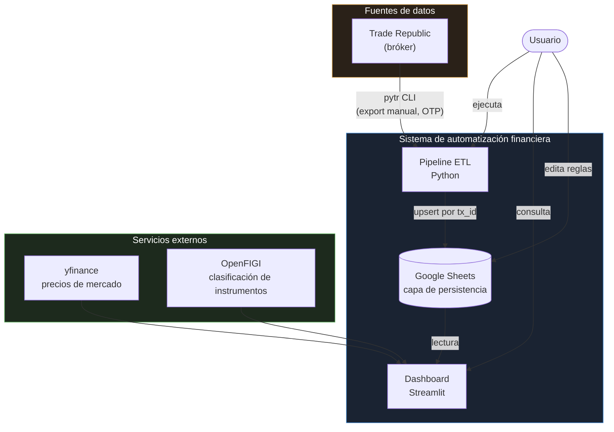
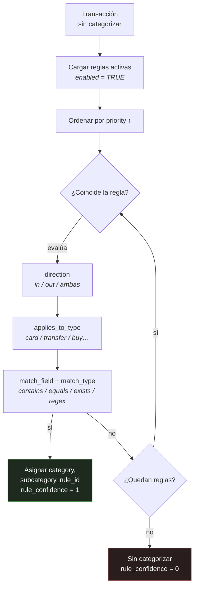
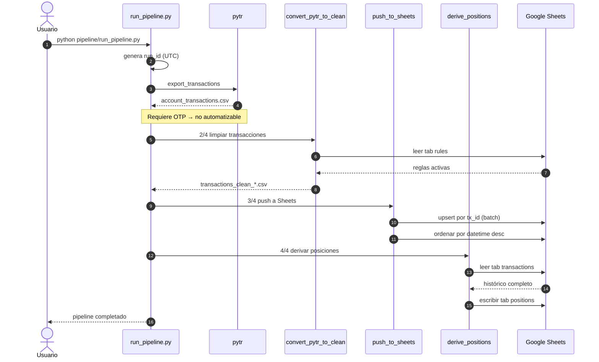
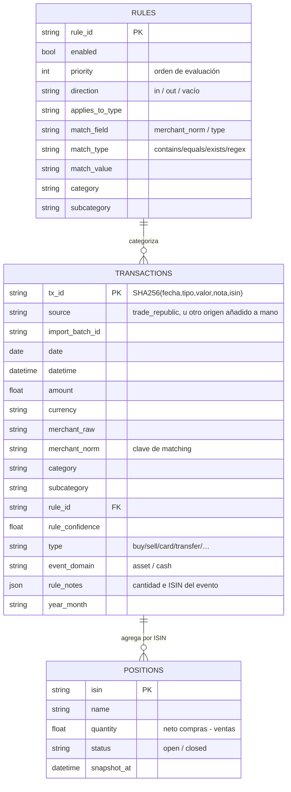
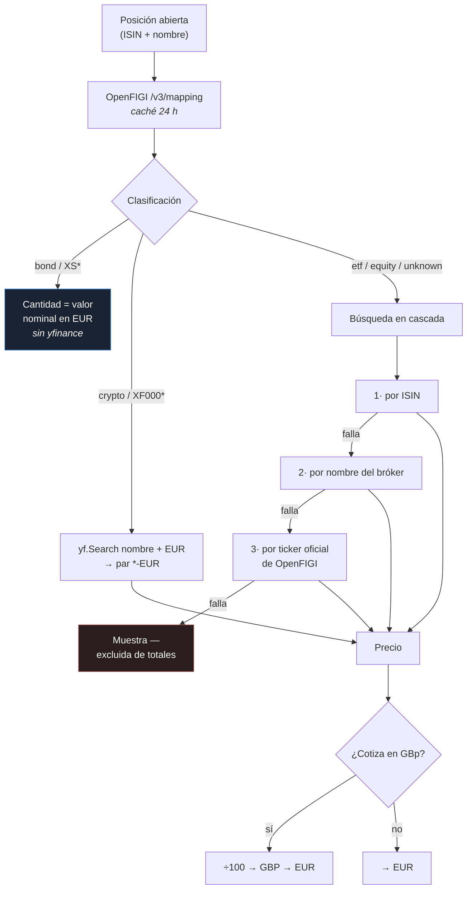
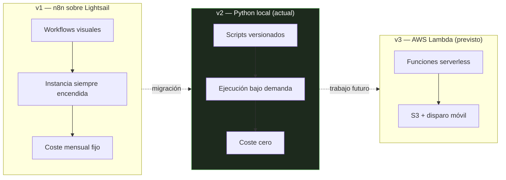

# Arquitectura del sistema

Diagramas de arquitectura del sistema de automatización financiera personal,
en cuatro niveles de detalle: contexto, flujo de datos, secuencia de ejecución
y modelo de datos.

---

## 1. Diagrama de contexto

Visión general del sistema y sus fronteras: qué es propio, qué es externo y
quién lo opera.

**Decisión de diseño:** Google Sheets actúa como
base de datos. No es la opción técnicamente óptima, pero resuelve tres
problemas a la vez sin infraestructura: persistencia, interfaz de edición de
reglas para el usuario final, y acceso concurrente desde el pipeline y el
dashboard.

---

## 2. Flujo de datos del pipeline ETL

```mermaid
graph LR
    A["Trade Republic"] -->|pytr export_transactions| B["account_transactions.csv<br/><i>cabeceras en español</i>"]

    B --> C["convert_pytr_to_clean.py"]

    subgraph transform["Transformación"]
        C --> C1["Mapeo de columnas<br/>ES → esquema normalizado"]
        C1 --> C2["Inferencia de tipo<br/><i>árbol de decisión</i>"]
        C2 --> C3["Motor de reglas<br/><i>categorización</i>"]
        C3 --> C4["Deduplicación<br/><i>tx_id = SHA256</i>"]
    end

    R[("tab <b>rules</b>")] -.->|"fetch en cada ejecución"| C3

    C4 --> D["transactions_clean_<br/>TIMESTAMP.csv"]
    D --> E["push_to_sheets.py<br/><i>upsert por tx_id</i>"]
    E --> F[("tab <b>transactions</b>")]
    F --> G["derive_positions.py<br/><i>agregación por ISIN</i>"]
    G --> H[("tab <b>positions</b>")]

    F --> I["Dashboard"]
    H --> I

    style transform fill:#1a2332,stroke:#4a90d9,color:#fff
```

### El motor de reglas

El componente diferencial del sistema. Las reglas viven en una hoja de cálculo,
no en el código: el usuario añade o modifica criterios de categorización sin
tocar Python ni desplegar nada.

Gana la primera regla que coincide por prioridad ascendente. El script
`apply_rules_to_sheet.py` permite reaplicar el conjunto de reglas
retroactivamente sobre todo el histórico, tocando únicamente las cuatro
columnas de categorización.

---

## 3. Secuencia de una ejecución completa

`run_pipeline.py` orquesta cuatro pasos secuenciales con un `run_id` compartido
que se propaga a los procesos hijos vía variable de entorno, de modo que todos
escriben en el mismo fichero de log.

**Nota sobre el orden de los pasos:** `push_to_sheets` se ejecuta *antes* que
`derive_positions`. Es deliberado — `derive_positions` lee el histórico desde
Google Sheets, no desde el CSV local, así que si se invirtiera el orden las
posiciones reflejarían el estado anterior a la importación.

**Limitación conocida:** la autenticación de Trade Republic exige un código OTP
enviado al móvil, lo que impide la ejecución desatendida. Es la razón por la que
el pipeline es de disparo manual y no está programado. Se documenta como
restricción del proveedor, no del diseño.

---

## 4. Modelo de datos

El esquema de salida de `convert_pytr_to_clean.py` tiene 25 columnas. `tx_id`
es un hash SHA256 sobre los cinco campos que identifican unívocamente un
movimiento, lo que hace la importación idempotente: reimportar el mismo export
no duplica filas.

### Lógica de posiciones y umbrales epsilon

`derive_positions.py` acumula el recuento firmado de participaciones a partir
del campo `rule_notes` de cada transacción con `event_domain = asset`. Los
umbrales epsilon evitan posiciones abiertas fantasma por redondeo fraccionario:

| Prefijo ISIN | Instrumento | Epsilon |
|---|---|---|
| `XS*` | Bonos | Comparación exacta (nominal entero) |
| `XF000*` | Cripto | `1e-6` |
| Resto | Acciones y ETFs | `0.1` |

---

## 5. Resolución de precios en el dashboard

Cascada de resolución de precio por posición. No hay ningún mapa de ISIN a
ticker escrito a mano: el sistema resuelve cada instrumento dinámicamente.

El motivo de la cascada: la etiqueta comercial que da el bróker (p. ej.
"Physical Gold USD (Acc)") a menudo no coincide con la nomenclatura de Yahoo
Finance, mientras que el registro oficial de OpenFIGI sí suele hacerlo.

---

## 6. Componentes y responsabilidades

| Componente | LoC | Responsabilidad |
|---|---:|---|
| `pipeline/run_pipeline.py` | 99 | Orquestación, `run_id` compartido, control de errores |
| `pipeline/convert_pytr_to_clean.py` | 349 | Normalización, inferencia de tipo, motor de reglas, dedup |
| `pipeline/derive_positions.py` | 227 | Agregación de eventos de activo → posiciones |
| `pipeline/apply_rules_to_sheet.py` | 269 | Reaplicación retroactiva de reglas al histórico |
| `pipeline/logger.py` | 61 | Logging estructurado, rotación (10 últimos runs) |
| `sheets/push_to_sheets.py` | 276 | Upsert por lotes, ordenación, borrado por batch |
| `app/data.py` | 371 | Capa de acceso a datos, precios, clasificación, caché |
| `app/main.py` | 1368 | Dashboard de 5 páginas |

Total: ~3.000 líneas de Python.

---

## 7. Evolución de la arquitectura

El sistema tuvo una versión previa basada en n8n desplegado sobre AWS
Lightsail, migrada después al pipeline en Python puro que describe el resto
de este documento. No se conserva material de esa etapa en el repositorio.

